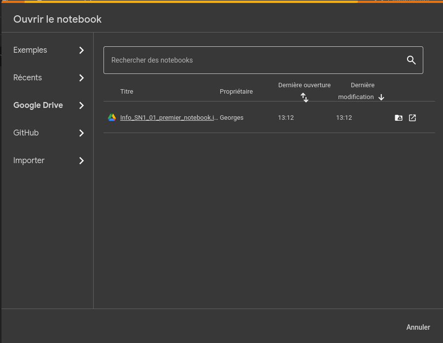

<h3 style='text-align: right;'>Programmation en sciences
 420-SN1-RE
 Éric Wenaas
 Georges Côté
</h3>

## Google Colab

Google Colab est un service en ligne qui permet d'écrire et exécuter le code Python à partir de n'importe quel navigateur et cela sans frais. 

Le lien est [https://colab.research.google.com/?hl=fr](https://colab.research.google.com/?hl=fr)

Cependant, pour pouvoir l'utiliser, vous devez vous connecter avec un compte Google. Si vous avez déjà une adresse Gmail, vous pouvez l'utiliser. Sinon, vous vous créez un compte Google gratuitement.

Appuyez sur **Connexion**

### Qu'est-ce qu'un notebook?

Les notebooks Jupyter sont des cahiers électroniques qui, dans le même document, peuvent rassembler du texte, des images, des formules mathématiques et du code informatique exécutable. Ils sont manipulables interactivement dans un navigateur web.[^1]

[^1]: https://python.sdv.univ-paris-diderot.fr/18_jupyter/.

Commençons par créer un nouveau notebook

Par défaut, le nom est quelque chose comme Untitled0.ipynb (interactive python notebook)

Le notebook est sauvegardé dans le dossier "Colab Notebooks" dans votre Google Drive.

Vous pouvez le renommner.

### Suggestions pour le nom des fichiers
Vous allez créer plusieurs notebooks pendant vos études collégiales et universitaires et vous devez être bien organisé pour retrouver le bon fichier rapidement.

Pour ce cours-ci, vous pouvez utiliser le préfixe 420_SN1_XX (420 étant le code pour Informatique) ou même Info_SN1_XX et où XX est remplacé pour le numéro de la semaine.

Par exemple, pour notre premier notebook pour la semaine 1, on pourrait le nommer Info_SN1_01_premier_notebook.ipynb.

Il ne semble pas y avoir un standard pour l'utilisation entre les séparateurs '_' et '-' mais il est fortement recommandé de ne pas utiliser un espace comme séparateur.

### Écrire notre première ligne de code

Habituellement, lorsqu'on débute, on écrit un programme qu'on appelle 'Hello World!' pour vérifier que tout fonctionne.

. 

Une fois qu'on appuie sur , on obtient

. 

## Ouvrir un notebook

Vous devriez voir tous vos notebooks dans la page d'ouverture:

. 